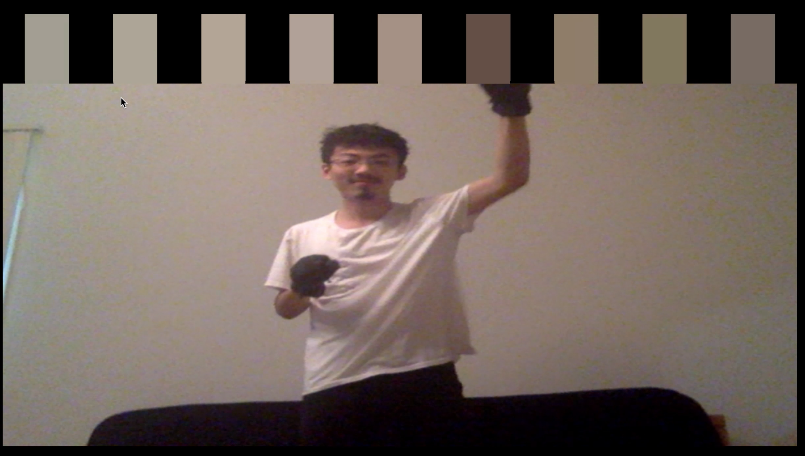

# cam - piano   

The Cam Piano is a novel digital instrument that blends together both real and virtual spaces, and lets you play songs in a variety of fun different interaction formats!

To run this project, clone this repo, and open up the `index.html` file.

If you want a more detailed description of what this project is and how it works, go to this website!

[website link!](https://cam-piano.weebly.com/)
